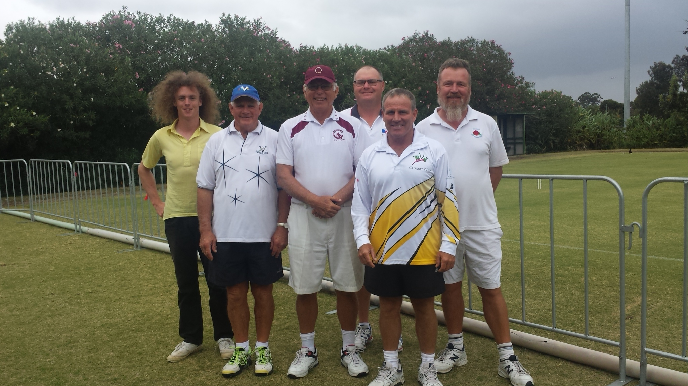
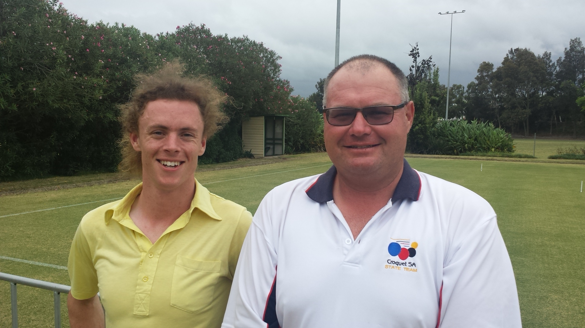
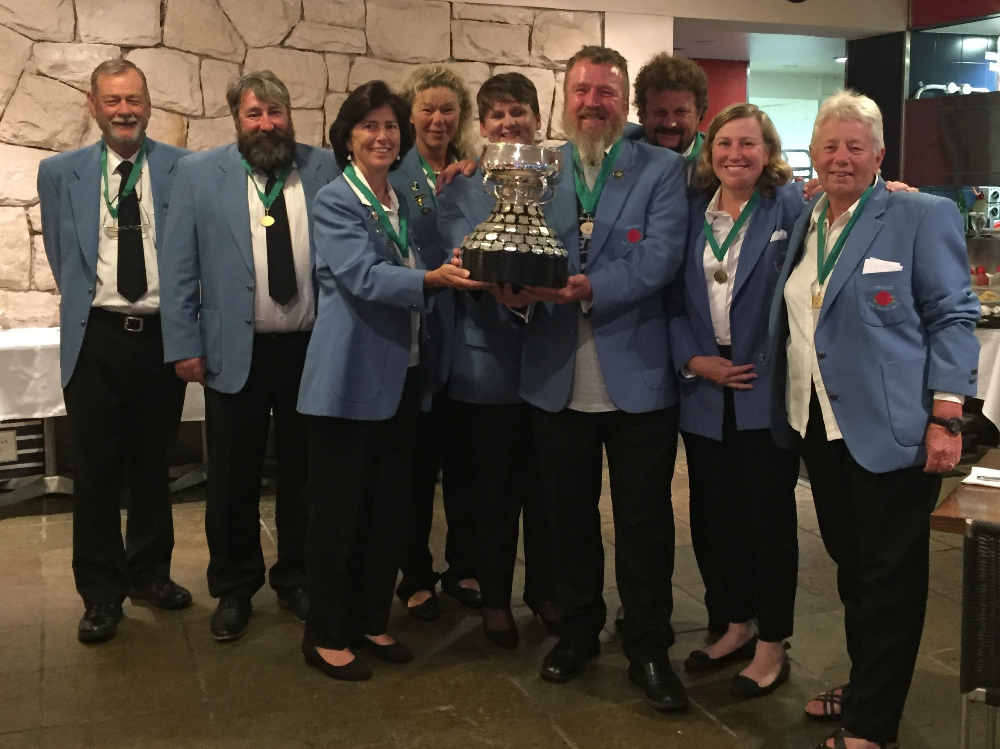

# Results

## Association Croquet Gold Medal

**Gold Medal** Simon Hockey SA

**Silver Medal** Callum Hyland TAS

**Bronze Medal** Ken Bald VIC

Jim Nicholls NSW

Alan Sands WA

Greg Whymark QLD

Players competing for the Gold Medal 
Left to right 
Callum Hyland TAS, Ken Bald VIC, Greg Whymark QLD, Simon Hockey SA, Alan Sands WA, Jim Nicholls NSW

Winners of Silver & Gold Medal 
Left to right 
Callum Hyland TAS (Silver Medal), Simon Hockey SA (Gold Medal)

## Association Croquet Women's Singles

**Winner of the English Cup** Alison Sharpe NSW

**Runner Up** Alix Verge NSW

**Third Place** Jannine Hawker WA

## Association Croquet Men's Singles

**Winner of The ACC Tray** Robert Fletcher VIC

**Runner Up** Stephen Forster VIC

**Third Place** Simon Hockey SA

## The Interstate Cup

**Winners of the Eire Cup** New South Wales

**Second Place and recipients of The WH Smith Tray** Victoria

New South Wales 
Left to right 
Alan Walsh, Peter Landrebe, Alison Sharpe, Alix Verge, Claire Bassett, Jim Nicholls, Alan Honey, Rosie Landrebe, Jean Pack.
